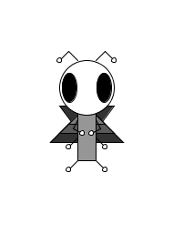

This is Boog:

He's a bug, but he's into ballet and leathermaking, which aren't things most bugs are into. Boog feels pretty lonely most of the time because he's the only creature of his species. Maybe one day I'll make him a friend.

I'll be using and modifying Boog throughout the first half of the Learning Processing book in order to explore concepts and syntax as they are introduced.
