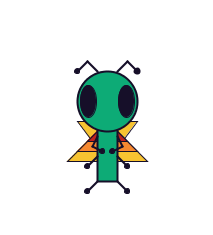
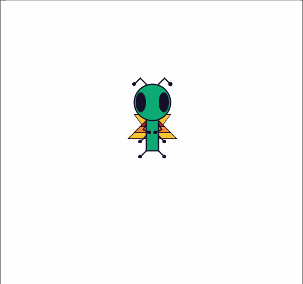

This is Boog:

He's a bug, but he's into ballet and leathermaking, which aren't things most bugs are into. He also laser eyes. Boog feels pretty lonely most of the time because he's the only creature of his species. Maybe one day I'll make him a friend.

Boog's sketches will be used to implement the techniques and concepts that I'm learning from other sketches into more fully developed programs.

In one of the earliest sketches, Boog hovers waveringly in place, and he can be provoked into movement by left-clicking within the program window. He fires lasers from his eyes at the user's cursor when the user holds down the right mouse button.

