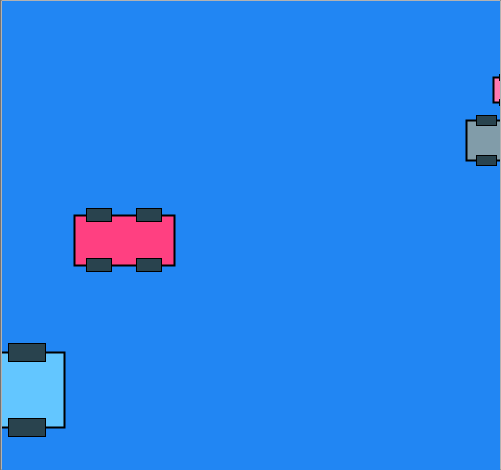

My earliest video game memory is from age four or five, driving tanks around on my dad's Atari. By tanks, of course, I mean squares with other squares on them. Imagination is powerful, though, and my tiny heart used to thump in my chest when my sisters and I battled it out on the wood-paneled living room television.

I've never developed much of an interest in real-life vehicles, but vehicles in video games have always been exciting. From those first Atari tanks to Final Fantasy Chocobos to Cruisin' USA cars to Mario karts to Halo Ghosts and Warthogs to WoW Mounts to Eve Cruisers to the floating platforms you push around in The Last of Us...

Vehicles are always exciting, but no matter how complexly they appear and behave, they are all fundamentally simple boxes that move around in carefully delineated spaces. They always imply identities and intelligences--the player identifies with his or her own vehicle and projects identities and intelligences onto the imaginary drivers of the other vehicles, even when those drivers are unseen and undesigned.

To explore the fundamentals of moveable, relatable entities, I'm going to design a few cars of my own.

First, a quick sketch to get some simple cars down on... paper? Screen, I guess.

The sketch generates an array of cars of random colors, coordinates, sizes, and speeds. Each of these random values is constrained, and I may want to come back in the future and allow the user to modify these constraints. I have also thought about confining the cars to individual lanes. If I were to do that, I'd be close to the engine for a Frogger-style clone.