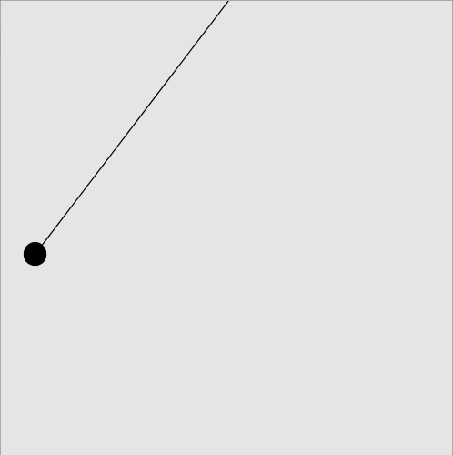
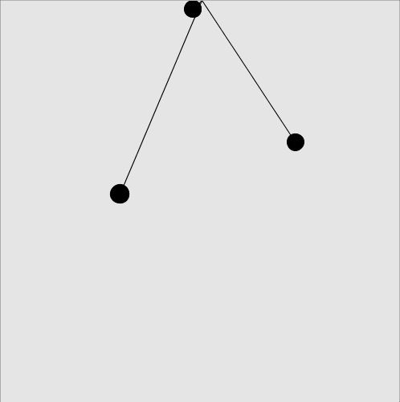

Sine and cosine are used to plot the trajectory of a tetherball-like object. 

A single Oscillator moves almost like a pendulum moving in a circle, but viewed from a two dimensional plane. A similar algorithm has been used in nearly every video game that has ever been made.

Of course, it was too tempting to stop at a single Oscillator, so here are:

Three:

Five:

Eleven:

One Hundred:

