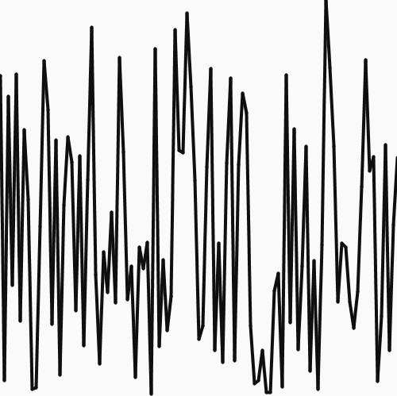

In college, my two-dimensional design teacher once told me that it's hard to paint a perfectly straight-looking line, but it's harder to paint a random-looking line. Unplanned chaos has a habit of looking carefully controlled, and the most chaotic-looking images are often the most carefully planned. This is probably why painters who focus on subjects like clouds and rocks and water tend to spend years practicing their craft and why they often use a medium that walks the line between controlled and chaotic (like watercolor). This is one reason why Jackson Pollock and his peers are so fascinating to art historians--their various methods of unleashing randomness within the confines of a carefully defined algorithm were ancient in a way (from the clouds of classical art to the ink washes of Asia), but the Abstract Expressionists were some of the first painters to allow this controlled randomness to become a painting's entire subject.

In the 1980s, a computer scientist named Ken Perlin joined this conversation by attempting to reconcile control and chaos in procedurally-generated graphics. How could he automatically generate the surface texture of a stone or a pond? How could he move beyond the jittery algorithms of random walks and random number selections to create a more natural-looking progression of values that were still somewhat chaotic?

His answer to these questions would eventually be called the Perlin Noise algorithm, and it works much like a basic random number generator. The major difference is that in the Perlin noise algorithm, the next random number in a sequence is confined to a range that is "close" to the previous random numbers that have been generated.

For example, a line generated based on a random series of numbers will look like this:

But a line generated based on the Perlin noise algorithm will look like this:

It's easy to immediately see that the Perlin line is more natural-looking. It could be the edge of an eroding river bank, the surface of tree bark, or a mountain top.