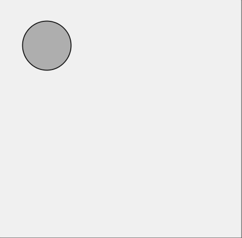

so much depends  
upon

a gray flat  
ball

glazed with refreshed  
pixels

beside the git console  
window

The most difficult part of this sketch was coaxing the ball to behave in a realistic way as it came to a halt. This is honest in a way, but it's not a true model of real-world physics. Like a painting or a poem, it captures some truths of motion but without all the axioms nailed down.

Some ideas to explore later:

* Allow the user to:
    * Restart the ball's descent
	* Add additional balls
	* Change the initial speed and bounciness of the ball
* Could be interesting if I combined this with the random circle sketch, generating an endless number of balls of random colors and sizes, at random positions. Perhaps these would collect along the bottom of the window or would continue to bounce forever.

Opportunities for continued learning and research:
* When I made the ball in an object, I realized that my ball's ability to bounce and roll to a stop is based on "physical" forces that relate to the surface. To pull this dependency outside of the ball, I allowed a surface to be passed into the ball's constructor. My concern is a ball will only know how to bounce off of one surface. In this sketch, that's fine; I only have one kind of surface. If my ball were to bounce around a more interesting environment, how would it know how to bounce against various surfaces? My suspicion is that each surface should apply its own forces, but how would this work exactly? How will the surface know when it's been hit? I think this is the kind of question that SOLID principles were intended to address, but I'm not sure what to do here.
