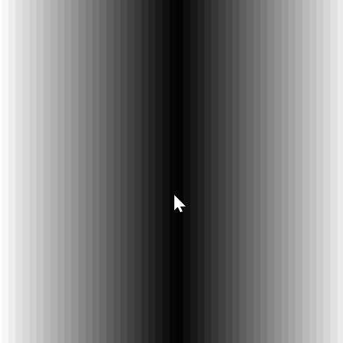
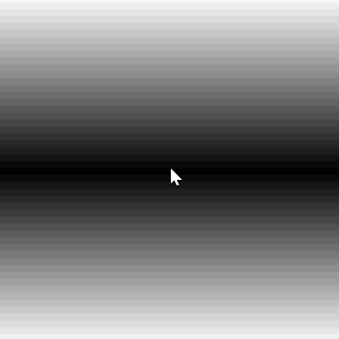

Wherever the mouse goes, it finds itself at the center of a chasm. Clicking the mouse determines whether the chasm is drawn horizontally or vertically.

Some ideas to explore later:

* The chasm could be made into a circular sinkhole with a third click of the mouse