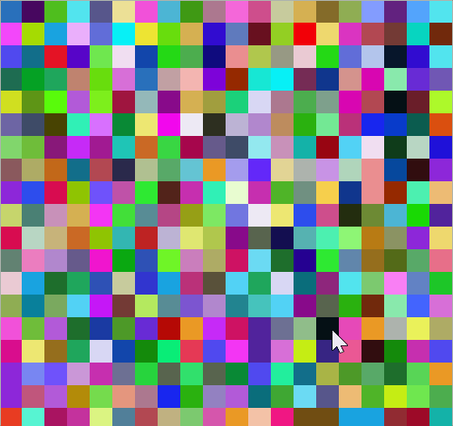

A grid of randomly colored and evenly sized squares is drawn to the screen. At first, they do not move, but when the mouse is clicked, they become a confetti of vacillating colors. When the mouse is clicked again, they rest.

Some ideas to explore later:

* Inputs could allow a user to constrain the values that are used for r, g, and b. if this were done, it would be possible to automatically generate random texture maps similar to the ones that are used in the dirt, grass, or rock surfaces of many video games.