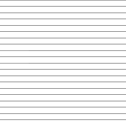
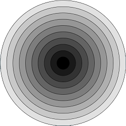
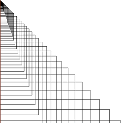
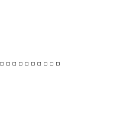
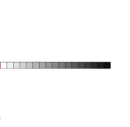
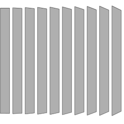

A series of drawings can be cycled through by clicking the mouse button. Each image was generated using simple for loops.

Some ideas to explore later:

* These images could be interactive, allowing the user to change colors or affect their appearance based on the mouse's position.