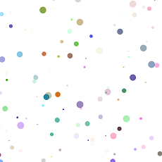
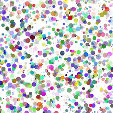
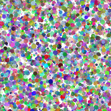
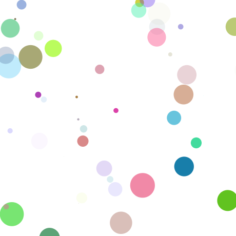
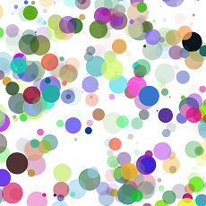
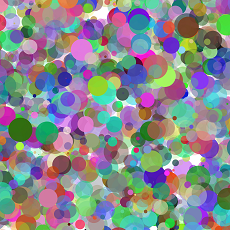

This program generates random circles.

Their sizes are random, their colors are random, and even their positions are random. They're unpredictable in a lot of ways, but they somewhat predictably combine to form a Leo Leonni-like texture.

Varying the maximum diameter creates different effects.

When the diameter is a maximum of 20, the pattern progresses like this:

When the diameter is a maximum of 50, the pattern emerges much more quickly:

Some ideas to explore later:

* Allow the user to:
** move a slider that will allow the user to select a maximum diameter, and have the size of the dots change dynamically.
** decide whether the dots populate at random positions, clustered around the mouse pointer, or precisely beneath the mouse pointer.
** expand and narrow the ranges of colors that are produced.
** clear the screen when the spacebar is pressed.
** select the background color from a list of options.
* Have the dots generate at random initially, but as the image develops, have the new dots base their color on neighboring dots.
