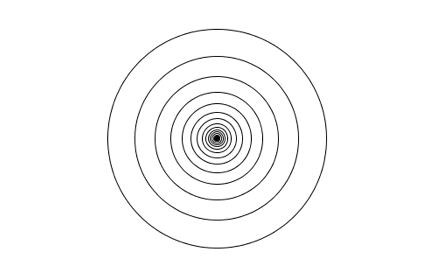
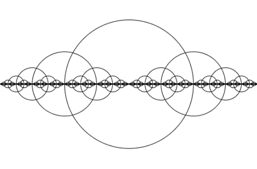

A series of drawings made using recursive calls to recursive calls which make calls to recursive calls.

Which make calls.

Also to recursive calls.

It's ellipses all the way down (until it isn't anymore).

