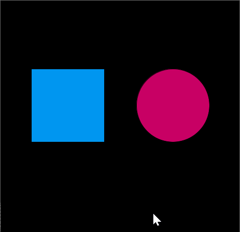
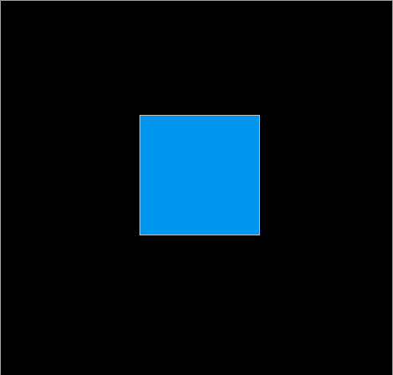

The sketches in this folder explore the ideas of rollovers and switches. 

Rollovers are explored through shapes or regions of the screen that respond in some way when the user's mouse passes over them.

Switches are similar to rollovers except that the user is required to click on the space to cause a response.

These basic features are fundamental to two-dimensional user interfaces. A designer can clearly communicate boundaries of affordance by determining which objects on the screen change when the mouse hovers over them and which objects react when clicked upon.

The sketch called Rollover contains two simples shapes--a rectancle and a circle. The shapes change color when the user positions the mouse within their boundaries.

The Button sketch contains a single button in the center of the screen, and this button toggles between two states when clicked.

