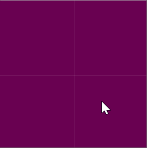

The background of this program shifts in color based upon the user's mouse position and click state.

The background becomes redder when the mouse is on the right half of the window and less red when the mouse is on the left half. It becomes bluer when the mouse is on the bottom half of the screen and less blue on the top half. It becomes greener when the left mouse button is depressed and less green when the left mouse button is released.

